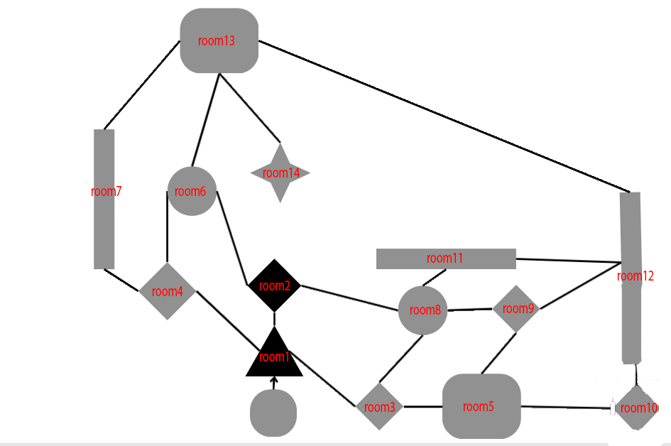

[Deployed Site](https://outpost.herokuapp.com/)

# Site Overview
The outpost is a simple text adventure game made in python. The player must navigate their way around and abandoned outpost and find a way to escape. There are many rooms to explore, and if the player is diligent and clever, the game should take no more than 10 minutes to complete.

## How to play
The Outpost is a simple game to navigate. Optional routes will be highlighted in the text, giving the player a north, south, east or west direction to follow, or 1,2 and 3 for doors and other optional pickups. The player can usually type an abbreviation of the word ; for example 'p' for pickup or n for north, and with these commands the user can navigate intuitively around the outpost.

## Goal
I was fascinated by the "choose your own adventure" books as a child, and wished to create a science fiction themed version. I had been thinking of this theme for a long time and this project seemed like the ideal place to bring this story to life.

## Technologies used
- [Heroku](https://heroku.com) to deploy the website.
- [Python](https://www.python.org/) for the main game.
- [GitHub](https://github.com/) as a remote repository.
- [Visual Studio Code](https://code.visualstudio.com/) as a local IDE & repository.

## Target Audience
- Lovers of science fiction
- People who enjoy text adventure games and interactive novels
- Those who enjoy a challenging adventure game

## Future Features
- I have had the idea for this project for a long time and felt it could make a compelling narrative. The arrangement of each room's array is organized so future additions and editing rooms would be quite simple. In the future I would like to further develop the storyline, adding more rooms, pickups, graphics and scenarios. However the text adventure game style is not to everyone's liking and I may change this to incorporate better graphics, UI and playability. 

## Design
- I began by drawing a map of all the rooms, and using this map I proceeded to populate each room with it's appropriate number, description, exits and pickups.
This made it easy to organize and iterate through each rooms dialogue and  options. I then added a few interactive elements such as a laser, a key to pickup and a book the player could examine which would teleport them to a random room. Given the scope of this project I found these to be a sufficient number of interactable objects. Below is a map of the rooms. 

## Data Structure
- The rooms in the outpost are organized into a class with 4 main attributes; number, description, options and extra. Number represents the room, while the description holds the text for the room. The Options category is an array which holds the rooms exits, and extra is there for any pickups or other interactable objects.

## Implementation
- I opted for a game loop which would print each scenario, the rooms being organized into a collection of arrays, containing the room number, room text, optional text for keys etc. and an array of exits. This array would contain a zero if that direction was unavailable, or if this exit was available, it would contain the connecting rooms number. This allowed me to organize and edit the rooms and connections in an intuitive way. I also gave the rooms an 'extra' variable, which if populated would allow the user to interact with something or change the initial description based on which direction they might come from. This was implemented sparsely but does work as a good option should I want to add objects in the future. 

# Testing

## Bugs
- There was a bug where the screen would run out of room on the page, I then created a bool
to clear the screen at appropriate times and this fixed the issue.
- There was a bug with the initial room, stripping the text could lead to a crash if the player entered an area twice. This was fixed by moving the text to the initial dialogue.
- There was a bug found with the lock on level 12, it seemed I had confused some of the logic with room 5, so it was a simple fix to rearrange the logic to fix the error.
- There were other small bugs, such as text not updating after a pickup , or room sequences not ordered correctly. After much testing these were easy to fix.

# Code evaluation
- Having tested the code on the Code Institutes Python Linter, I cleaned all the errors not related to text. Seeing as there are large portions of text to print it was flagging some of these with either e501 line too long or  W291 trailing whitespaces. In future I should opt to use a text file for large portions of text to avoid this from happening
# Deployment 

## Deployment to Heroku
1. Navigate to [Heroku](https://dashboard.heroku.com/apps)
2. Find 'New' and select 'Create a new app'
3. Name your application and create app.
4. Go to to 'Settings'
5. Under Buildpacks click the add buildpacks button. Select Python and save changes and then node.js and save changes.
6. Navigate to the 'Deploy' section. 
7. Connect to GitHub, search for your repo and confirm. 
8. Choose branch to deploy.
9. There was an error in heroku deploying after the 28th of November, the fix was as follows
- from the dashboard in Heroku, click configure dynos
- you should see an unconfigured node index.js, you can edit this with the pen on the right.
- while editing click the slider to turn on then click on confirm, the dyno is now configured.

## How to Fork
1. Login to [GitHub](https://github.com/).
2. Locate the repository 
3. Click on the 'Fork' button in the upper left.
4. Your should now have a forked version of the repository.

### Version Control
- I used git as the version control software. With the use of the commands git add . , git commit -m "", and git push , I was able to add, save and push code to the github repository.

## References
I got the sleep text function from MattH's answer here [Stackoverflow](https://stackoverflow.com/questions/4627033/how-to-print-a-string-with-a-little-delay-between-the-chars)